# Existing Features
This section outlines the existing features of the project with screenshots to showcase.
Return to main [README.md](README.md) to read more about project's planning, conceptions, technologies used, deployment.

1. Navigations
   * Different navigations for logged-in and non-logged-in users. For non-logged-in users, the navigation is limited to index page, registration, and log in page. In order to keep it clean and more focused to a designated space, navigation design on registration and log in page is different from the navigation on index page.
   
      
      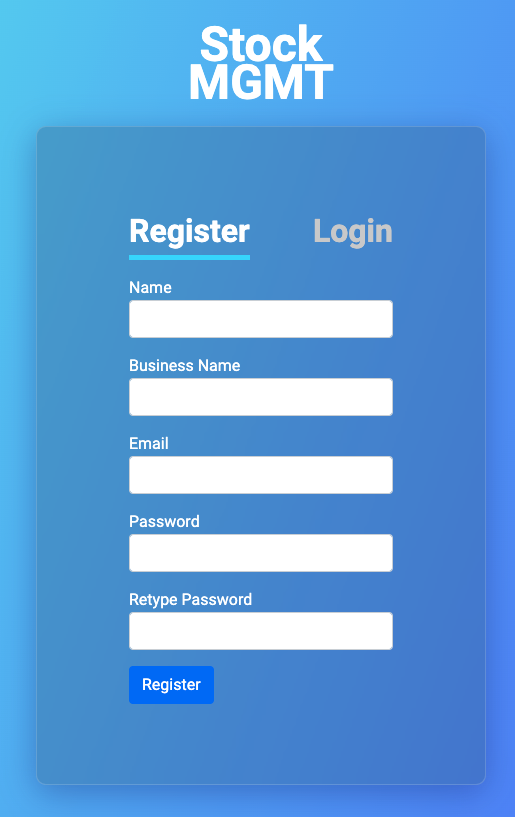

   * Navigation for logged-in users is positioned on the left side of the screen. The navigation is responsive for 3 different screen sizes: collapsed to a toggler button on mobile screen, icons only on tablet screen, and full width with icons and texts on desktop. Each navigation item has a link to its corresponding features and active page is highlighted.
  
   
   
   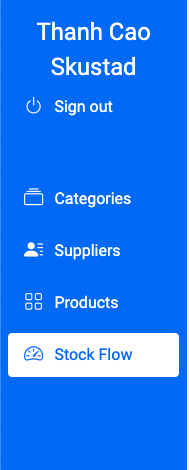

2. Landing page
   * Landing page is a simple static page in order to introduce what the application is about. The landing page is divided into 3 sections: hero intro, features of the app, testimonials, and call-to-action with buttons directing to registration page. Since this project is for educational purposes, the testimonials and some texts are purely fictional in order to create a feel and (fictional) trustworthiness of the project.
   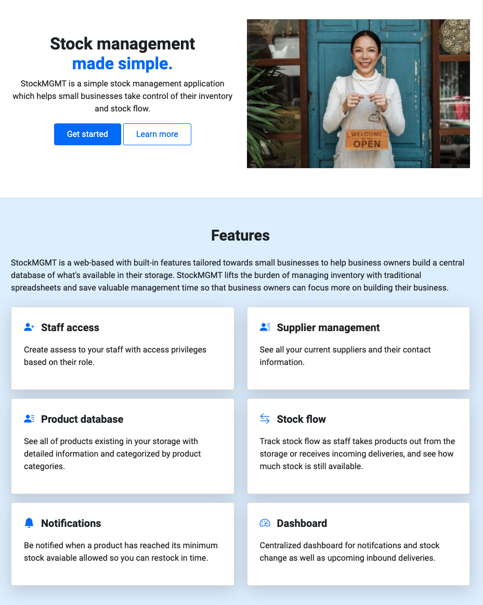

3. Responsiveness
   * The application is designed and built with mobile-first approach. The application is responsive to all screen sizes and devices to make sure users can check up on their stock flow anywhere, anytime, on any device.
   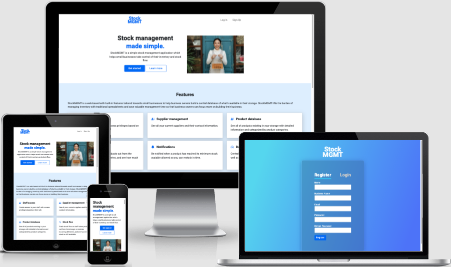

4. Account functionalities
   * Business owners can register an account on StockMGMT and log in using their unique email address, and logout. Upon registration, their business name is registered unique so that nobody else can create another account with the same business name.
   * As an account holder, they can edit their profile and create/edit/delete access to their staff either with full admin or limited staff privileges.
    
   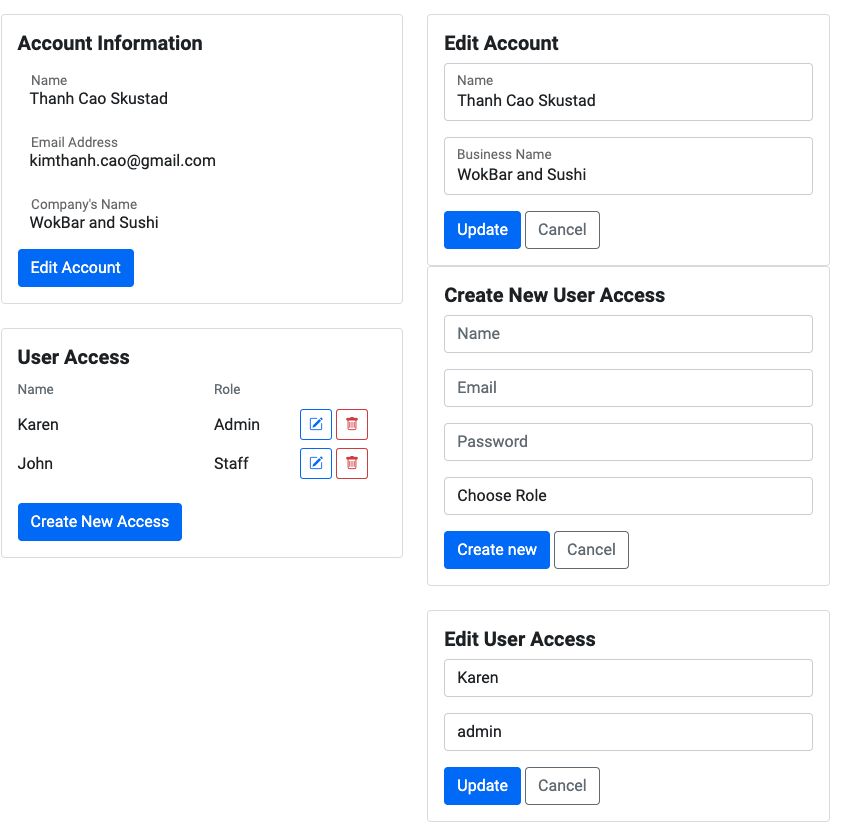

5. Role-based privileges and access
   * Admin access have full access and privileges to *create/edit/delete* user access, categories, suppliers, products, and pending stock orders.
   * Business owner is set as account_holder upon registration so that the account holder cannot be deleted by accident by staff members with admin privileges.
   * Staff privileges can *view* and *search* all products, suppliers, and pending stock orders. Staff privileges can *update* individual product's stock, *update* products' stock through pending stock orders and *approve* pending stock orders.

6. Product category management
   * Only admin has access to view/create/edit/delete product categories.
  

7. Supplier management
   * Suppliers are organized in accordion menus. Clicking each accordion menu will expand the accordion item to show supplier's contact details.
  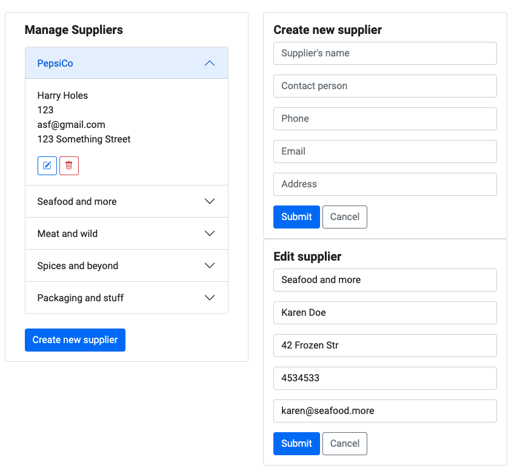

8. Product database management / Search for product
    * Product database is organized in accordion menus which is categorized based on the product categories each product is assigned to. Clicking each accordion menu will expand the accordion item to a list of products within the same category. Clicking each product will show the product's details and it is possible to update product's stock at this page.
    
      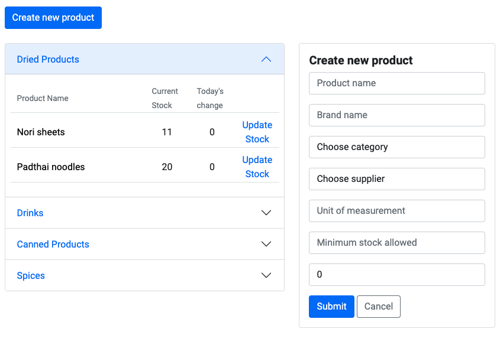
    * Product's details page show all information about the respective product. Here, users can edit, delete, and update the product's stock.
    
      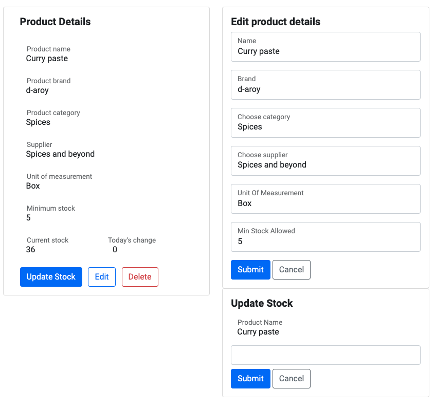
    * Search for product is a search bar that allows users to search for products based on their name. Search bar has type ahead functionality which shows users the products available in the database based on the search query.
    
      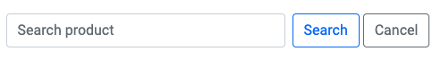

9.  Dashboard view divided in to three sections:
    * Restock now: This section shows the products that are out of stock or have a stock level below the allowed threshold (min_stock_allowed). There is no actions available on this section as this section acts as a reminder to restock the products. The section doesn't show up if there is no product that needs to be restocked.
    * Pending stock: This section shows the expected incoming deliveries categories by suppliers and its status whether or the delivery has arrived/stock has been updated based on receivables. Pending stock is labeled `pending` with yellow badge if it not arrived and `done` with green badge once somebody has approved the stock update. The pending stock orders showing here dated back to 7 days from today's date onwards. If user wants to search for historical data, there is a search functionality where user can search by supplier or supplier and delivery date.
    
      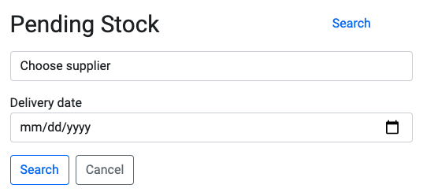
    * Stock update: A quick access to search for product and update stock right on dashboard view. The list of products being shown here are those that have stock change within today's date.
    
      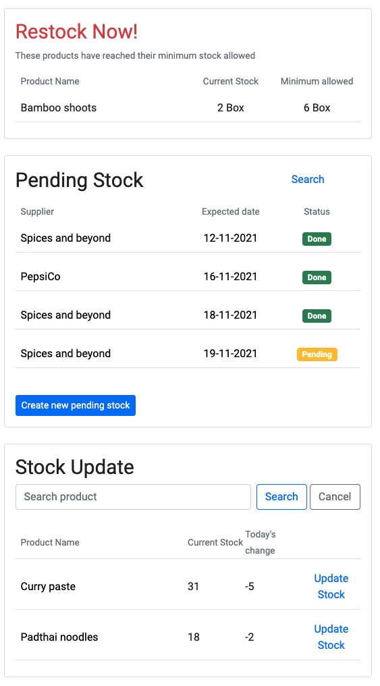

10. Pending stock orders: creation and flow
    * The flow of of a pending stock order is as following: 
      * Create new
      * View pending stock details where admin users can edit the order details or delete entirely
      * Update stock based the actual amount of stock received from delivery.
      * Once the stock update form has been submit, a green `Approve` button is shown where user has to approve in order to make final update/changes to the database.
      * Once the stock has been approved, the pending stock order status is updated from yellow `pending` to green `done`. After this, no further actions are allowed to this pending stock order.

   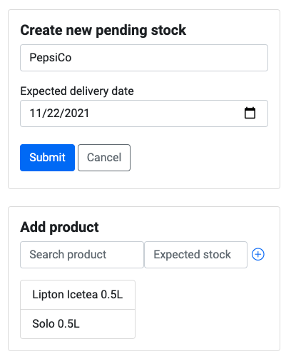
   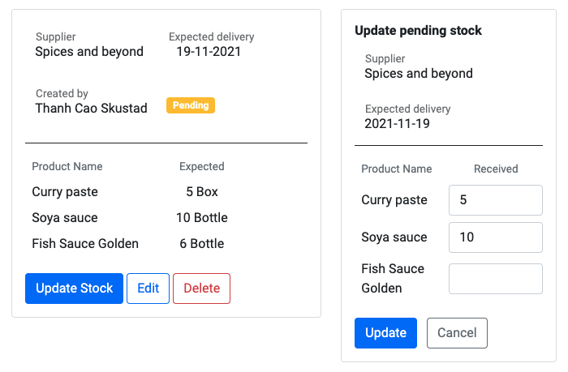
   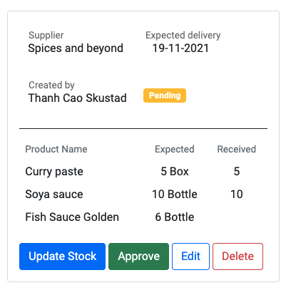
   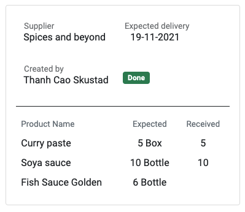

11.  Other functionalities:
* Type ahead functionality: suggest products based on the search query. If user searches for products, type ahead will query all records available in the Product collection and show the results matches user's regex query. If user searches for products when creating a new pending stock order, query is filtered by chosen supplier.

   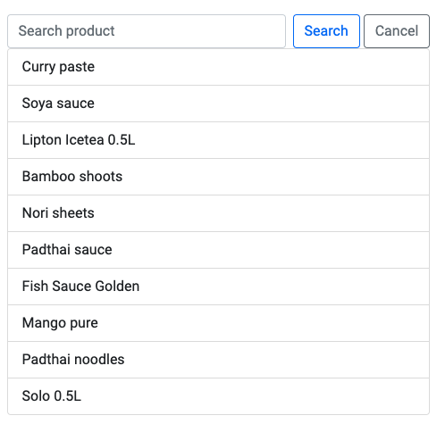
   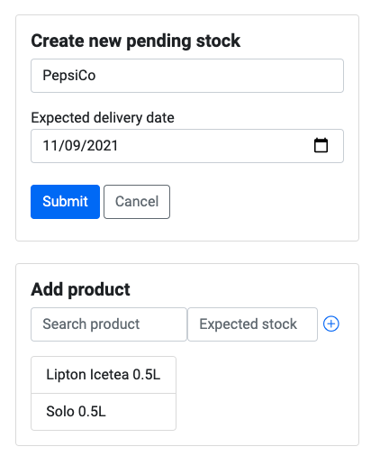
* Flash messages for user feedback if an action is successful or not. Success flash messages are styled with blue shades and error flash messages are styled with red shades.

   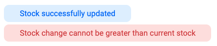