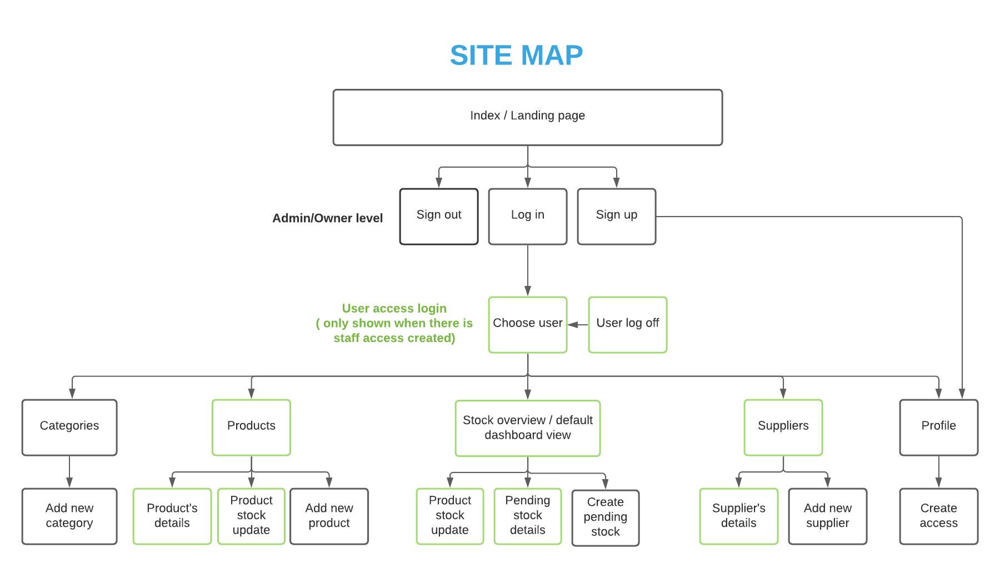
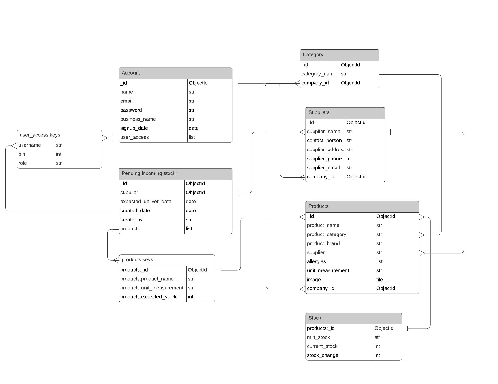
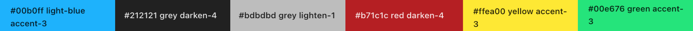
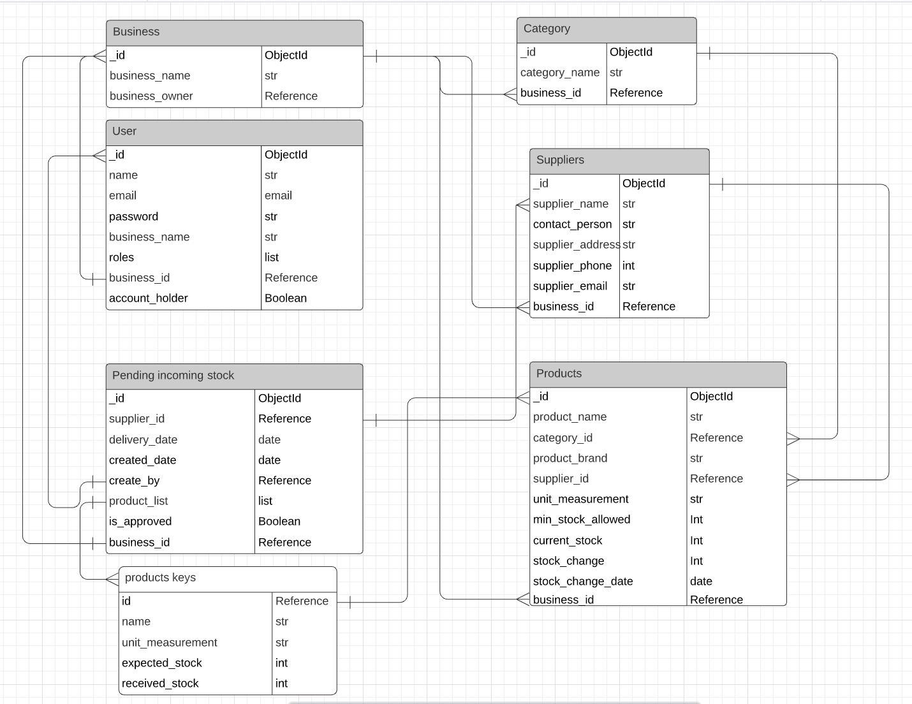

# Stock Management App
## Introduction
Project milestone 3 for Code Institute Full-stack development program: backend development using Python-Flask and MongoDB.

The purpose of the project is to create a stock management app which helps small business owners automate the process of tracking the stock flow and move away from spreadsheets or pen and paper which are prone to human errors. This project is for educational purpose to build a full-stack site showcasing data handling, database structure, CRUD user functionality. Some texts written on index page are fictional in order to create a feel for the project. The problem to which this app is the solution, is based on a real life problem I have as co-owner of a take-away shop selling Asian food; therefore the business logic behind the app is drawn from I how would like to operate the stock flow management in my business.

## Showcase


Link to the site: [http://ms3-stockmgmt.herokuapp.com/](http://ms3-stockmgmt.herokuapp.com/)

## Table of Contents
  - [User Experience (UX)](#user-experience-ux)
    - [User Stories](#user-stories)
    - [Strategy](#strategy)
    - [Scope](#scope)
    - [Structure](#structure)
      - [Information Architecture](#information-architecture)
      - [Data Structure](#data-structure)
    - [Skeleton](#skeleton)
      - [Design](#design)
      - [Wireframes](#wireframes)
      - [Design changes](#design-changes)
  - [Features](#features)
    - [Existing features](#existing-features)      
    - [Future implementations](#future-implementations)
  - [Technologies used](#technologies-used)
    - [Languages](#languages)
    - [Programs and Tools](#programs-and-tools)
    - [Frameworks and Libraries](#frameworks-and-libraries)
  - [Testing](#testing)
  - [Deployment](#deployment)
    - [Development](#development)
    - [GitHub Pages](#github-pages)
    - [Cloning the project locally](#cloning-the-project-locally)
    - [Forking the repository](#forking-the-repository)
  - [Credits](#credits)
    - [Code](#code)
    - [Content](#content)
    - [Media](#media)
    - [Acknowledgements](#acknowledgements)

## User Experience (UX)
### User Stories
* As a new visitor, I want to:
  * know what the app is about upon landing the site.
  * be able to sign up in order to start using the app.
   
* As an account holder/ a business owner/ admin user, I want to:
  * create/read/update/delete user access to my staff with limited privileges.
  * create/read/update/delete suppliers that I order stock from.
  * create/read/update/delete product categories.
  * create/read/update/delete products.
  * see a list of products I have in my inventory grouped by categories.
  * search for a product in the product list.
  * update products' stocks.
  * create a pending order for incoming stock.
  * see the details of pending incoming stock orders in order to confirm and update the stock change according.
  * be notified when a product has reached its minimum stock available in order to restock on time.
  * see which product has had stock change today.  

* As a user with staff privilege, I want to:
  * see a list of products avaible in the inventory grouped by categories.
  * search for a product in the product list.
  * update products' stocks.
  * see the details of pending incoming stock orders in order to confirm and update the stock change according.
  * be notified when a product has reached its minimum stock available to stay informed and escalate to managers if needed.
  * see which product has had stock change today.

### Strategy
The idea behind this project is based on my current need for an automated process to control stock flow for my business. The current process of recording stock in and out is very manual without detailed records of how much stock is going in and how much is taken out. When there is a need to check the stock level, staff is asked to go through the entire inventory in the storage to eyeball which product needs to be restocked. This often results in human errors where they miss out certain products which leads to buying the missing products at retail shops at higher price or not able to buy at all due to too short notice. Therefore the objective of this stock management app is to allow small business owners to create a common database of all the products available is the inventory, be notified when a product has reached it minimum stock allowed, and see the stock flow coming in and out.

### Scope
1. Content requirements
* Introduction what the app is about upon landing
* List of: product categories / products (grouped by categories) / suppliers / staff acess / pending stock orders
* Detailed information of: products / suppliers / pending stock orders
* Stock flow info:
  * Products with stock change today
  * Expected delivery (pending stock)
  * Products that have reacherrd their minimum stock level allowed

2. Functionality requirements
* Account holder:
  * Sign up / Log in
  * Edit account
* CRUD functionality to create staff access with admin or limited privileges
* CRUD functionality for product categories / products / suppliers
* Stock flow update:
  * Enter number of stock change for a chosen product
  * Auto calculate current stock level after update
* Pending stock inflow:
  * Create a pending stock inflow: stock expected to be delivered by suppliers
  * Update stock change and change status of pending stock inflow to done
* Dashboard view:
  * Minimum stock level is reached
  * Pending stock inflow
  * List of products with stock change today

### Structure
#### Information Architecture

The site map above shows the architecture of the app. Upon landing the app, business owner can create an account for their business with admin privilege. Once successfully registered, they are redirected to Profile page where they can create access to their staff with limited privileges which are marked with green borders. There are two redirecting options upon admin's logging in:
* if admin hasn't created any access for staff, admin is redirected to dashboard stock overview page.
* if admin has created access for other staff, a further user access login page is shown so that admin and staff has to select their respective username and input password in order to authenticate and render the correct viewing permissions for users. In real life application, I imagine the app is used on-site on a tablet that belongs to the business so the app is always logged in for that one business. Consequently, this "Choose user" step is the default landing page so that staff can easily and quickly access stock overview page when they are on duty of receiving or taking out stock. Staff is not allowed to log in the database without the admin login so that they cannot manipulate the stock levels elsewhere.

#### Data Structure



### Skeleton
#### Design
* CSS framework chosen for this project is [Bootstrap v5.1](https://getbootstrap.com/). This framework is chosen for its clean, simple and clear response UI design, which is easy for novice users to navigate and interact with data and database.

* Color: I want to keep the color scheme as simple as possible in order to avoid too much distractions. The key color of the app is blue as blue hints a sense of business profressional and trustworthy. Therefore, blue will be used on the main action buttons, headings, and other highlighting purposes. Other than that, universal traffic light colors are used for other actions such as red for `delete` action, yellow for `pending`, green for `approve` and `done`. Primary texts are written in black `#212529` while secondary texts are gray-ish `#6C757B`. Below image shows color schemes which is based on Bootstrap color palette.


* Font: Roboto is the main font used for this app as it is a simple easy-to-read font which is suitable for all device sizes.
  
#### Wireframes
* Wireframes for mobile: [View](readme-assets/skeleton-wireframe-mobile.png)
* Wireframes for desktop: [View](readme-assets/skeleton-wireframe-desktop.png)
* Collection of forms being utilized: [View](readme-assets/skeleton-wireframe-forms.png)
* Tablet version will be similar to mobile version with an exception that the side navigation bar will remain visible instead of collasped. The `edit` pages (and edit forms) will be similar in design as `create` with some minor adjustments in text and actions.
  
#### Design changes
1. Index page: extend texts on index page with a section about product's features, a section for testimonials, a call to act section, in order to give more (fictional) credibility to the product.
2. Remove some features due to time-constraints: 'Choose user' step (the second log-in step for staff), product's image.
3. Minor changes in terms of section layouts on the app and side navigation bar.
4. Data structure was rethought and refined as I learned more about MongoDB and relationships. The current data structure set up is as below:


## Features
### Existing Features
Features that have been implemented can be found at [FEATURES.md](FEATURES.md).

### Future Implementations
1. Features related to account management: change/reset password, invite users to join the database
2. Product's image upload and rendering
3. Bulk create/edit/delete data
4. Pagination
5. Save and show/search historic data for stock updates
6. Aggregrations to show interest statistics on dashboard
7. Integration with sales data
etc.

## Technologies Used
### Languages
* [HTML5](https://developer.mozilla.org/en-US/docs/Web/Guide/HTML/HTML5) - build up layout and content of the application.
* [CSS3](https://developer.mozilla.org/en-US/docs/Web/CSS) - add custom styling and override Bootstrap stylings to fit with the theme of the website.
* [JavaScript](https://www.javascript.com/) - to add interactive functionailities to the app
* [Python](https://www.python.org/) - to build backend functionalities handling data, database interaction, and CRUD functionalities.
  
### Programs and Tools
* [Figma](https://www.figma.com/) -  for wireframe creation.
* [Visual Studio Code](https://code.visualstudio.com/) - the code editor being used to build the project.
* [PicResize](https://picresize.com/) - to resize large images.
* [Glassmorphism CSS Generator](https://ui.glass/generator/) - to generate glassmorphism effects for registration and login page.
* [Chrome DevTools](https://developer.chrome.com/docs/devtools/) - used heavily for debugging during development and testing process.
* [Git](https://git-scm.com/) - the built-in Git feature in VS Code was used for version control and push to github.
* [Github](https://github.com/) - Github is used to store project's code remotely. 
* [Google Fonts](https://fonts.google.com/) - to import Roboto font which is the main font for this project
* [Bootstrap Icons](https://icons.getbootstrap.com/) - implement icons for navigation menu, forms, actions.
* [Autoprefixer CSS online](https://autoprefixer.github.io/) - to parse CSS and add vendor prefixes.
* [MongoDB](https://www.mongodb.com/) - the database being used to store application data and query.
* [Heroku](https://www.heroku.com/) - platform being used to deploy the application
* [W3C Markup Validator](https://validator.w3.org/), [W3C CSS Validator](https://jigsaw.w3.org/css-validator/), [JSHint](https://jshint.com/), [PEP8 online](https://pep8online.com/), [Lighthouse](https://developers.google.com/web/tools/lighthouse/),  - to validate the code syntax and to check the code quality for HTML markup, CSS, JavaScript, Python, and the site overall performance.

### Frameworks and Libraries
* [Bootstrap v5.1](https://getbootstrap.com/) - the responsive front-end framework to build the layout and style the app.
* [jQuery](https://jquery.com/) - a Javascript library used for simplicity of traversing HTML document and manipulation, event handling, and ajax.
* [Flask](https://palletsprojects.com/p/flask/) - a micro web framework written in Python which is the barebone of this stock management app. 
* [Jinja2](https://jinja.palletsprojects.com/en/3.0.x/) - a web template engine which is used to generate markups.
* [Werkzeug](https://werkzeug.palletsprojects.com/en/2.0.x/utils/#logging) - generating and hashing password for security.
* [MongoEngine](http://mongoengine.org/) - MongoEngine is a Document-Object Mapper for working with MongoDB from Python.
* [Flask-MongoEngine](http://docs.mongoengine.org/projects/flask-mongoengine/en/latest/) - provides integration with MongoEngine.
* [Flask-User](https://flask-user.readthedocs.io/en/latest/) - provides easy set up for user authentication, user mnagement, registration/login, role-based authorization.
* [Flask-Login](https://flask-login.readthedocs.io/en/latest/) - a dependency used by Flask-User to handle login and logout.
* [Flask-Mail](https://pythonhosted.org/flask-mail/) - a dependency used by Flask-User to send registration confirmation email to users.
* [Flask-WTF](https://flask-wtf.readthedocs.io/en/1.0.x/) and [WTForms](https://wtforms.readthedocs.io/en/3.0.x/) - flexible forms validation and rendering library for Python web development with CSRF Token

## Testing
Testing can be found in its own section [TESTING.md](TESTING.md)

## Deployment
### Development
1. Environement:
The project was developed using VS Code editor and its integrated version control feature to commit gits, which are then pushed to GitHub in order to store the codes remotely. The project is hosted on Heroku and can be accessed at [http://ms3-stockmgmt.herokuapp.com/](http://ms3-stockmgmt.herokuapp.com/).

2. Project management and development workflow:
* Project management: In order to keep track of my own progression and to-dos, I created [2 kanban project boards](https://github.com/thanh-cao/ms3-stock-management/projects) on GitHub: one is for front-end work, and the other is for backend work. Based on project's requirements and wireframes, I scope out the tasks and assign them to the corresponding project board with 3 phases: To do, In progress, and Done.
* Creating issues as a way to keep a list of small things to build / to do / to fix as I go along with developing the big features.
* Branches: I created a branch for each feature, develop on the respective branch, and pushed them to GitHub.
* Git commit conventional message following [Conventional Commits](https://www.conventionalcommits.org/en/v1.0.0/)

3. Requirements to develop and deploy project:
There are 2 requirements in order to develop the project locally and then deployed to Heroku:
* Database and connection string with [MongoDB](https://www.mongodb.com/):
  * Create an account on [MongoDB](https://www.mongodb.com/)
  * Create a cluster of your choice following the instructions on [MongoDB Atlas](https://docs.atlas.mongodb.com/tutorial/create-new-cluster/)
  * Access the cluster you have created and create a database with name of your choice.
  * Under `Overview` tab, find `connect` button and click it.
  * Choose second connection method using MongoDB's native drivers. Choose driver Python and version that is suitable to you. You will find a connection string in the `Connection String` section which will be used to connect to MongoDB when you set up the environment locally and to deploy to Heroku.

* Create an account with [Heroku](https://www.heroku.com/) following the instructions from the site.

### Forking the project
1. Log in to GitHub and navigate to this project's respository: [ms3-stock-management](https://github.com/thanh-cao/ms3-stock-management).
2. Just above the navigation menu of the repository (above the Settings button), locate the Fork button.
3. The original copy of the repository is now copied on your GitHub account which allows you to view and/or work on the codes without affecting the original work.

### Cloning the project
Follow these steps to clone this project:

1.Log in to GitHub and navigate to this project's respository: [ms3-stock-management](https://github.com/thanh-cao/ms3-stock-management).
2. Under the navigation menu of the repository, locate and click the button "Code" which shows different options to clone or download.
3. To clone this repository using HTTPS, copy the link under "Clone with HTTPS".
4. Open Git terminal.
5. If needed, change the current workspace to the location where you want the repository to be cloned
6. Type git clone and paste in the URL copied in step 3 and press Enter.

### Setting up the environment for development
1. Create `env.py` file:
   * Create a env.py file in the root directory of the project.
   * Add the following code to the file:
    ``` Python
    import os
    os.environ.setdefault('IP', '0.0.0.0')
    os.environ.setdefault('PORT', '5000')
    os.environ.setdefault('SECRET_KEY', 'your_secret_key') # insert your own secret key
    os.environ.setdefault('MONGO_URI', 'your_mongo_connection_string') # insert connection string from the steps above
    os.environ.setdefault('MONGO_DBNAME', 'your_db_name') # insert your database name

    # Further info on setting email server below
    os.environ.setdefault('MAIL_SERVER', 'smtp.gmail.com')
    os.environ.setdefault('MAIL_PORT', '587')
    os.environ.setdefault('MAIL_USERNAME', 'your_gmail_address')
    os.environ.setdefault('MAIL_PASSWORD', 'your_gmail_password')
    os.environ.setdefault('USER_EMAIL_SENDER_EMAIL', 'your_gmail_address')

    os.environ.setdefault('DEBUG', 'True') # set to False when deploying to Heroku
    ```
    * If you are using gmail to send emails, you will have to turn off the "less secure apps" option in your gmail account. More info can be found [here](https://support.google.com/accounts/answer/6010255). If you use another email service provider, please check their documentation for how to set up stmp server to send emails through another app.
    * Add `env.py` and `__pycache__` to .gitignore to secure your sensitive data.

2. Create virtual environment and install dependencies:
   * Create a virtual environment in the root directory of the project.
   * Type `python3 -m venv venv` in the terminal and press Enter.
   * Type `source venv/bin/activate` in the terminal and press Enter.
   * Type `pip install -r requirements.txt` in the terminal and press Enter.
  
3. requirements.txt and Procfile:
   * The currently available `requirements.txt` file from this repo contains the list of dependencies that are required to run this project. If you develop the project further using more packages and dependencies, you can add them to the `requirements.txt` file with the following command in terminal:
    ```
    pip freeze > requirements.txt
    ```
    * The currently available `Procfile` file contains the command `web: python app.py`. It is used to determine which command to run when the app is started on Heroky. If you develop the project further with a different commands to run the app, make adjustment to `Procfile` file accordingly.
    * Push your changes to requirements.txt and Procfile to GitHub if any.

### Deployment to Heroku
1. Log in to [Heroku](https://www.heroku.com/)
2. On top right corner of the screen, locate the `New` button and the choose `Create new app`.
3. Give a unique name to the app, choose appropriate region, and click `Create`.
4. Access your app dashboard and click on `Deploy`.
5. Under `Deployment method`, choose GitHub and coonect to the respective repository.
6. Enable automatic deployment and click `Deploy`.
7. Set up environment on Heroku by going to `Settings` tab.
8. On `Config Vars` section, click `Reveal Config Vars`
9. Based on `env.py` file, add all the environment variables to the `Config Vars` section.
10. On top right coner of the app's dashboard, locate the button `Open app`. You will be able to see you deployed app with link to live site.

## Credits
### Code
Thanks to the almighty Internet and its endless resouces to learn, I have found some very useful tutorials, challenges that were very specific to help me build certain features for my project.
1. Tutorial on creating form macros with Bootstrap styling by Pretty Printed- [Link](https://www.youtube.com/watch?v=Frb0NXe1IHw)
2. Flask form submission without page reload on GeeksforGeeks which gives me an idea to use ajax to communicate between frontend and backend - [Link](https://www.geeksforgeeks.org/flask-form-submission-without-page-reload/)
3. Wes Bos' 30-day JavaScript challange (challenge number 6) which gives me a guide on creating type ahead function using ajax - [Link](https://javascript30.com/)
4. Git commit conventional message - [Link](https://www.conventionalcommits.org/en/v1.0.0/)
5. Codes examples adapted from respective Flask extensions' user guide in order to set up extensions and implement functionalities.
   
Other than the sources above, I studied thoroughly the documentations and source codes of the tools, programs, extensions in order to write my own codes. On top of that, various forums, portals, discussions, youtube channels, etc were used heavily in order to refine my understanding of Python concepts and methods, Flask frameworkand extensions, MongoDB. To name a few I have used:
* [StackOverflow](https://stackoverflow.com/)
* [GeeksforGeeks](https://www.geeksforgeeks.org/)
* [dev.to](https://dev.to/)
* [Pythonise learning Flask series](https://pythonise.com/series/learning-flask/)
* [Pretty Printed youtube channel](https://www.youtube.com/c/PrettyPrintedTutorials/playlists)
* Code Institute's Task Manager mini-project
### Content
All the content throughout the page is written by me, inspiration for index page from [Sortly](https://www.sortly.com/).

### Media
1. Hero image: Photo by Ketut Subiyanto from [Pexels](https://www.pexels.com/photo/ethnic-female-cafe-owner-showing-welcome-we-are-open-inscription-4473398/)
2. Portraits for testimonials: Photo by Ketut Subiyanto from [Pexels](https://www.pexels.com/photo/concentrated-asian-woman-working-in-cozy-cafeteria-4473490/), Photo by Kampus Production from [Pexels](https://www.pexels.com/photo/woman-in-gray-jacket-smiling-7289739/), Photo by Meruyert Gonullu from [Pexels](https://www.pexels.com/photo/man-in-shoe-store-near-shelves-with-boxes-6888761/), Photo by Polina Tankilevitch from [Pexels](https://www.pexels.com/photo/cashier-in-store-3735168/).

### Acknowledgement
Big shout to my mentor Narender Singh for the constructive feedback to help me improve my skills and knowledge. A big thanks to the amazing Code Institute's Slack community as always for reviewing, giving feedback, and mental support.