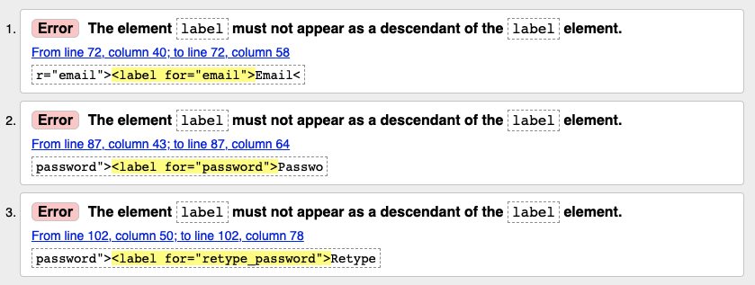
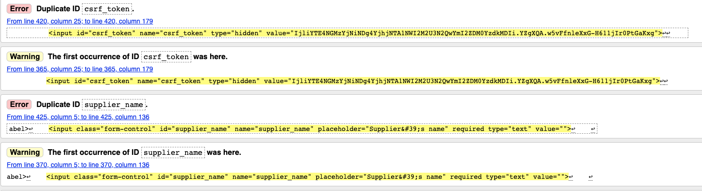
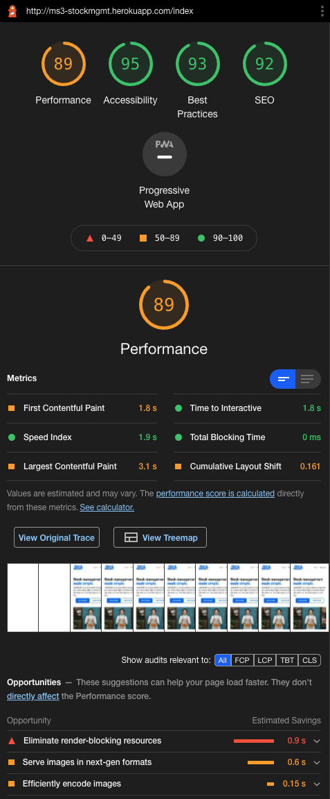
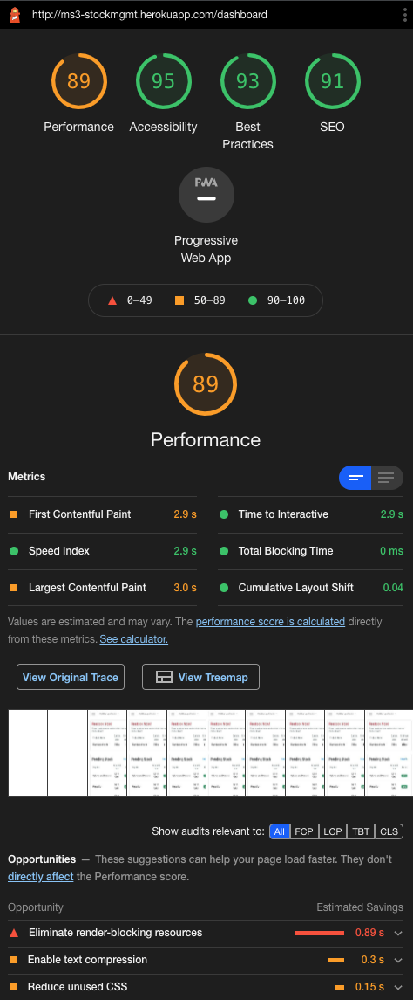
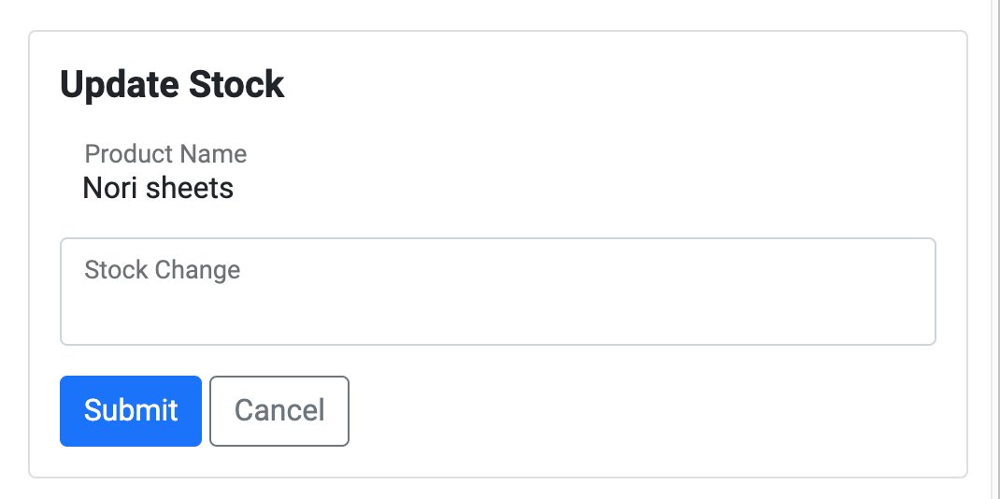
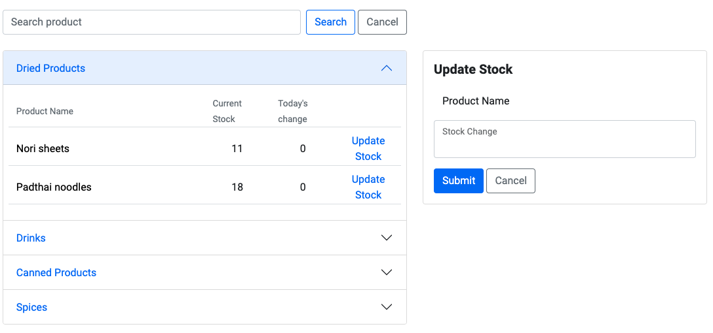
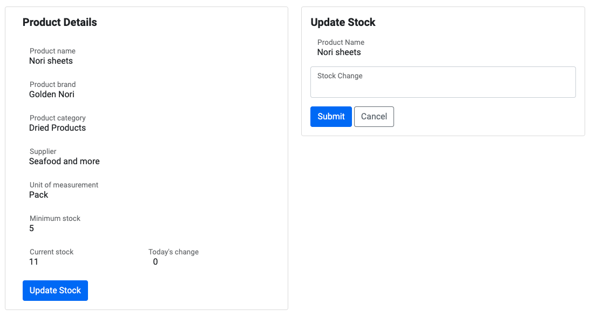
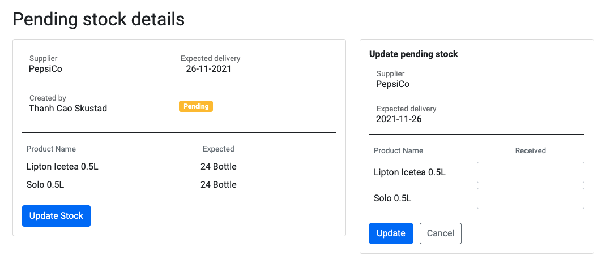
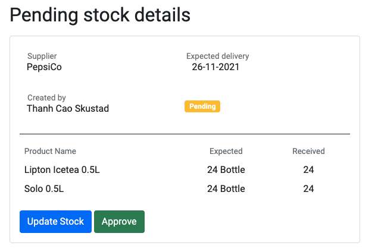
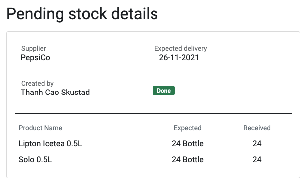

# StockMGMT - Testing
This section documents the testing phase of the StockMGMT application covering reports from validators and tools testing, manual user stories testing, further functionality testing, known bugs and issues and what is left could be further improved.
Return to main [README.md](README.md) to read more about project's planning, conceptions, technologies used, deployment.

## Table of Contents
  - [During development](#during-development)
  - [Validators and tools](#validators-and-tools)
  - [User stories testing](#user-stories-testing)
  - [Further functionality testing](#further-functionality-testing)
  - [Known bugs and issues](#known-bugs-and-issues)
  - [Further possible improvements](#further-possible-improvements)

## During development
* During the front-end development process, Chrome DevTools was employed greatly in order to debug and adjust layout responsively on multiple devices. Console tab was used intensively in order to debug and test JavaScripts functions and logic. Furthermore, various browsers (Google Chrome, Firefox, Safari, Internet Explorer) and physical devices (13-inch screen, 27-inch screen, iPhone X, Samsung Galaxy S9, iPad) were used to view the website in order to check the responsiveness.
* Python shell in terminal was used to print out variables and test functions.
* Manual testing different possible scenarios when developing a feature.

## Validators and tools
### W3C Markup Validation
[W3C Markup Validator](https://validator.w3.org/) was used to validate the HTML code of the website in all pages. There were some minor errors and warnings such as duplication of class, missing value `for` for `label` element, missing session heading, etc. They were all fixed accordingly to show no errors afterwards.

Some noticable errors to be raised in this testing documentation: 
1. Validating registration and login page shows up 2 errors:
   * Stray end tag `
`: this is due the way I set up the base template and extends to the login and registration pages. A simple adjustment of `{block body}` fixes this issue.

      
   * The nested element `label`: this is due to the use of my custom form macro and Flask-User's default setup for RegistrationForm class and its fields. I initially wanted to use `placeholder` text instead of `label` element to keep a clean design. However, Flask-User's default RegistrationForm doesn't have `render_kw` argument, so I had to use `label` element instead, not knowing that it could cause a hidden `label` element to be rendered. Rewriting the fields without using form macro fixes the issue.
  

2. Duplicate ID on the same page
  * My design approach for some pages was to have the create new and edit data forms on the same page as view data page with different action routes on the form for each funtionality. In the beginning, I hard-coded both of the forms in the markups and hide the forms using `d-none` Boostrap class. Clicking buttons to show forms with toggle the `d-none` class to show and hide the form. Even though the functionalities on the surface work as expected. Having duplicate IDs breaks the rule of HTML. To fix this issue, I refactor and assigned the forms' HTML in a JavaScript variable and then use `showForm()` and `hideForm()` functions to add / empty the forms from the DOM. Since I use `WTForms` for form creation and validation, I had to create the form variables in the page's script tag so that when `jinja2` renders the page, it can also render the WTForms fields accordingly. After this refactor, this issue is fixed.
  
  

### W3C CSS Validation
[W3C CSS Validator](https://jigsaw.w3.org/css-validator/) was utilized to validate the CSS syntax written. The results show no errors.

### Lighthouse audit
[Lighthouse](https://developers.google.com/web/tools/lighthouse/) was used to test the performance of the application in each page. The results show that the application performs well in all pages and a common theme is Accessibility, Best Practices, and SEO return above 90 points while Performance fell a bit short but still above 85 points. Looking at the suggested opportunities which could help optimize the performance, I decided to not act upon them because Lighthouse suggest to eliminate or reduce unused CSS or JavaScript, all of which are core libraries I use to build the website, and therefore cannot be eliminated.

### JSHint
[JSHint](https://jshint.com/) was used to test the quality and JavaScript syntax use of the three JavaScripts files in this project. The results show no particular errors except for missing semicolons, which I have accordingly updated in the code. There are warnings on unused variable `select` on typeahead.js file and `showForm` on search.js file. However, `select` function is used embedded with the html `<li>` element while `showForm` is a function writte in the scripts.js file, which search.js also has access to the variable. Therefore, these 2 warnings can be ignored.

### PEP8 online
[PEP8 online](https://pep8online.com/) was used to test the quality and syntax of the Python code in this project. The results show error code `E501 Line too long` for line 29 and 93 on forms.py file. I have tried to adjust the formatting for this particular line. However, it is either I get code `501` or code `E128 continuation line under-indented for visual indent`. I decide to keep the proper indentation for readability and the line is only 85 or 87 character longs which don't affect much the readability of the code.

## User stories testing
### As a new visitor, I want to...
1. ...know what the app is about upon landing the site.
* When users enter landing page, they will see right away the logo and the hero section with texts introducing right away what the application is about.
* The landing page also has other sections introducing the core features of the app and testimonials from business owners. All these information help user understand the purpose of the app and in which context the application can be used.

2. ...be able to sign up in order to start using the app.
* The main navigation bar on landing page is simple and focus to only 2 actions: registration and login. There are also 2 other buttons directing to registration page on index page. Therefore, it is very clear and simple for new, even novice, users to locate where they can sign up.

  
* The registration and login page are designed with simple, clean, and focus approach so that users are not distracted by other actions than just register an account and log in.

  

### As a user/ a business owner/ admin user, I want to...
1. ...create/read/update/delete user access to my staff with limited privileges.
* When business owner / account holder access their account page, they will see a list of all users with their access level.
* Account holder can create new user access to their staff either with full `admin` privilges accessing all pages and functionalities available in the app, or with limited `staff` privileges.
* Staff users can log into the app using the same log in page as for all users using email and password. However, the information and functionalities being shown to them is:
  * filtered by the business_id (the company) belongs so that they will see the product database of their company, not others'.
  * filtered by role-based authorization with the help of `@roles_required` decorator which is used to restrict access to certain pages based on the user's access level.

2. ...create/read/update/delete suppliers that I order stock from.
* When account holder access supplier page for the first time, they will see only one possible action button with a clear descriptive text `Create new supplier`. Upon clicking the button, a form will appear to which allows them to fill in the details and create a new supplier.
* Newly created supplier will be shown on the list of suppliers in accordion design. Clicking each accordion item header will display the supplier's details and two further possible action buttons to `edit` and `delete` the supplier. The button icons are `pencil` and `trash` in blue and red respectively, which are universal icons and colors to hint `edit` and `delete` actions. Visually hidden texts are also available for screen reader users.

3. ...create/read/update/delete product categories.
* When account holder access supplier page for the first time, they will see only one possible action button with a clear descriptive text `Create new category`. Upon clicking the button, a form will appear to which allows them to fill in the category name and create a new category.
* Newly created category will be shown immediately on the page. Each category has two further possible action buttons to `edit` and `delete` the category. The button icons are `pencil` and `trash` in blue and red respectively, which are universal icons and colors to hint `edit` and `delete` actions. Visually hidden texts are also available for screen reader users.

4. ...see a list of products I have in my inventory grouped by categories...and...
* When account holder access product page and if user has created categories before but not yet products, they will see a list of categories being displayed with no products. Once a new product is successfully created and assigned to a category, the product will show up under its respective category. The product list is organized in accordion design whose header is the name of the category. Clicking each accordion header will show a list of products under that category.

5. ...create/read/update/delete products.
* On product listing page, users can see clearly only one possible action button with a clear descriptive text `Create new product`. Upon clicking the button, a form will appear to which allows them to fill in the product details and create a new product.
* Each product item shown on the product listing accordion has a gray hover effect when users hover their mouse over to indicate that the product can be clicked to view the product's details.
* At product's details page, admin users can see 3 action buttons which clear descriptive texts what each button does. Clickin `edit` button will show a form to edit the product's details. Clicking `delete` button will delete the product from the database. Clicking `update stock` button will allow users to update product's stock level.

  

6. ...search for a product in the product list.
* On top of product listing page, there is a search bar with a descriptive text hinting to users that they can search for a product by typing in the search bar.
* Search bar has type ahead functionality which queries all the products available in the database that belongs to the user's company and matches with user's regex search query as they type in order to let users know what products are available.
* Beside product listing page, search product feature is also available on dashboard where user is directed to upon login for quick access to the functionality.

  

7. ...update products' stocks.
* Each product item in the product listing accordion has a button to update the product's stock level. This action is also available on product'details page level, and dashboard when user has searched for a product.
* Clicking the `Update stock` button will show a simple form showing the name of the product whose stock level is being updated, and an empty input field so that user can enter the number of stock that is changed (either taken out or put in).

8. ...create a pending order for incoming stock.
* Creating a pending stock order is available on dashboard where user can see very clearly a button with its descriptive text `Create new pending stock`. Upon clicking the button, user is directed to a page where a form is shown to allow them to fill in the neccessary information and create a new pending stock order.
* By design, the user will intuitively understand the pending stock is created per supplier as it is the first and required field in order to create. When adding the products into the form, type ahead functionality is available showing a list of products filtered by supplier in order to inform users these are the available products can be added.
 
  

9.  ...see the details of pending incoming stock orders in order to confirm and update the stock change according.
* On dashboard, user can see a list of pending incoming stock orders, each has gray hover effect to indicate that the order can be clicked to view the order's details.
* Admin users can see all the possible actions for an order with clear descriptive texts: `edit`, `delete`.
* Clicking `Update stock` will show a form to enter the number of stock actual received upon delivery.
* Clicking `Update` on the update pending stock form will update the pending stock order's details with the newly entered information on receivables to compare with the expected / ordered number of stock so that user can double check.
* A green `Approve` button is now available on the update pending stock form to approve the pending stock order.

10. ...be notified when a product has reached its minimum stock available in order to restock on time.
* On dashboard, if there is any product that has reached its threshold, a section called `Restock Now!` will be shown with red heading to get user's attention.
* If there isn't any products, the section will be hidden entirely so not to cause clutter and stress to users upon landing / login.

  

### As a user with staff privilege, I want to...
1. ...see a list of products avaible in the inventory grouped by categories...and...
2. ...search for a product in the product list...and...
3. ...update products' stocks.
* When a user with staff privilege enters product listing page, they can see a list of products in the inventory grouped by categories created by admin users.
* Each product item shown on the product listing accordion has a gray hover effect when users hover their mouse over to indicate that the product can be clicked to view the product's details.
* On top of product listing page, there is a search bar with a descriptive text hinting to users that they can search for a product by typing in the search bar.
* Search bar has type ahead functionality which queries all the products available in the database that belongs to the user's company and matches with user's regex search query as they type in order to let users know what products are available.
* Beside product listing page, search product feature is also available on dashboard where user is directed to upon login for quick access to the functionality.
* Each product item in the product listing accordion has a button to update the product's stock level. This action is also available on product'details page level, and dashboard when user has searched for a product.
* Clicking the `Update stock` button will show a simple form showing the name of the product whose stock level is being updated, and an empty input field so that user can enter the number of stock that is changed (either taken out or put in).
* As a user with limited staff privilege, the actions available to them are limited to only `view` and `update stock`. `Edit` and `Delete` are not available.

4. ...see the details of pending incoming stock orders in order to confirm and update the stock change according.
* On dashboard, user can see a list of pending incoming stock orders, each has gray hover effect to indicate that the order can be clicked to view the order's details.
* On pending stock's details page, staff user can see on possible action which is to update the stock level based on how much stock they receive on delivery.
* Once stock number is updated, user can double check once again the number of stock received and the expected number of stock to be delivered. A green `Approve` button is now available on the update pending stock form to approve the pending stock order.
* Once approved, no further possible action is available on the pending stock order.
* As a user with limited staff privilege, the actions available to them are limited to only `view`, `update stock`, and `approve`. `Edit` and `Delete` are not available.

5. ...be notified when a product has reached its minimum stock available to stay informed and escalate to managers if needed.
* On dashboard, if there is any product that has reached its threshold, a section called `Restock Now!` will be shown with red heading to get user's attention.
* If there isn't any products, the section will be hidden entirely so not to cause clutter and stress to users upon landing / login.

6. ...see which product has had stock change today.
* On dashboard, if there is any product that has stock change today, it will be shown under `Stock update` section displaying the name of the product, its current stock level, and how much stock is changed today to have an overview of the flow of stock today.

## Further functionality and logic testing
1. Form validations
* Intensive testing of form validations during development and after is done to ensure that all the fields are correctly validated and that the form is not submitted with invalid data.
* If form is not validated, the form will not be submitted and the user will be notified with an error flash message.
* If form is validated, the form will be submitted and the user will be redirected accordingly. A success flash message is also shown to make the user aware of the success of the form submission.
2. Navigation bar: all the links go to the correct location with indicator to inform users where they are on the application.
3. Accordions work properly. The first accordion item is opened while the rest stays collapsed. Upon clicking the accordion heading, the items / information within the accordion will be opened.
4. Responsiveness on different devices: application was thoroughly reviewed on different physical devices as well as Chrome DevTool.
5. Type ahead functionality suggests products based on user's regex search query. On pending stock creation and edit, type ahead suggests products filtered by chosen supplier.
6. Correct database being shown: only data that belongs to the user's company is shown.
7. Correct information and functionalities are shown based on user's role: admin users have full access and functionalities while staff users cannot create new, edit, or delete data.
8. Stock update validation: when user updates stock being take out (input a negative number), it should be validated that the new current stock level does not go below 0.
9. The flow and actions possible for pending stock order: user needs to input number of stock update first which is not going to be updated on the database. Only when an order is approved, the stock level will be updated on the database.
10. Create / edit / delete functionalities and routes work properly and reflected in changes in the database.

## Known bugs and issues
Due to time constraints and (still) limited experience and knowledge, a few interactions and functionalities are not fully perfected.
1. Clicking type ahead suggestions can take 2 clicks to register the event.
2. When user adds product to pending stock form, if user chooses to type in the product name by themselves instead of clicking the type ahead suggestion, and the input does not match exactly the product name in the database, the scripts will fail to detect the product's ID in order to populate related information and further actions to be done on the product.

## Further possible improvements
1. Refactor app structure with blueprint
   * The current app and code structure is not ideal to scale and maintain in the future to add more features and functionality. Refactoring the app into blueprint structure was supposed to be done. However, I came into some issues while doing this and with the time constraints, I decided to leave it as is right now since it is a nice to do for the scope of this project. This will be done at a later point when the time permits for my own learning. 
2. Dynamic form generation with JavaScripts maybe could have been done in a more clever and cleaner way.